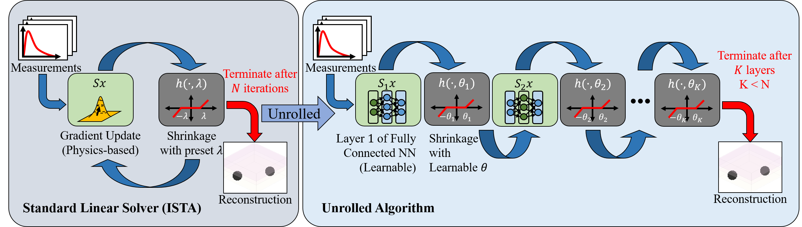
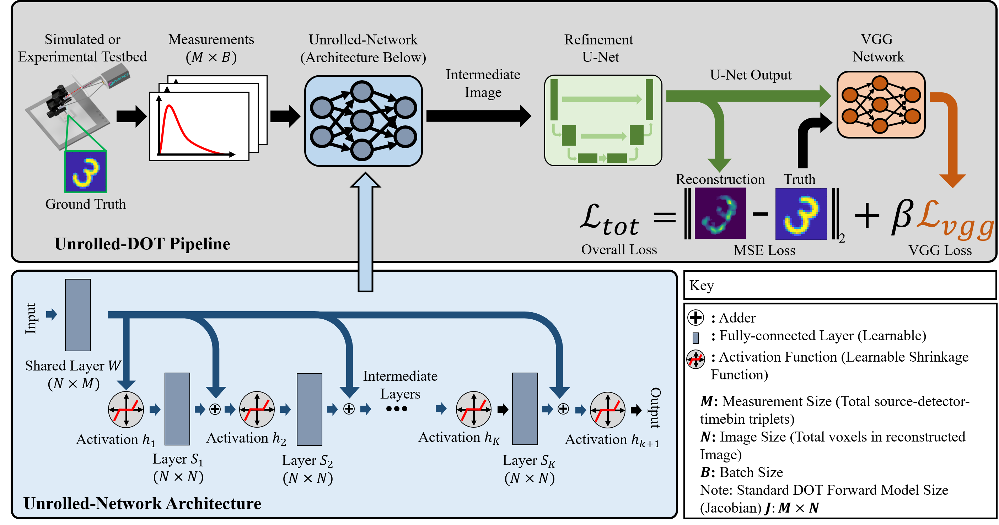

# Unrolled-DOT: An Interpretable Deep Network for Diffuse Optical Tomography

### [Paper](https://doi.org/10.1117/1.JBO.28.3.036002) | [Data](https://doi.org/10.5281/zenodo.7654959)

Official Implementation for Unrolled-DOT: an unrolled network for solving (time-of-flight) diffuse optical tomography inverse problems.

[Yongyi Zhao](https://yongyizhao.com/), [Ankit Raghuram](https://sites.google.com/view/araghuram/), Fay Wang, Hyun Keol Kim, Andreas Hielscher, Jacob Robinson, and Ashok Veeraraghavan. 



## Setting Up

```
git clone https://github.com/yyiz/unrolled_DOT_code.git
cd unrolled_DOT_code
```

### Requirements
Before running the Unrolled-DOT package, please install the following:
- Python 3.6+
- MATLAB R2019b+
- Jupyter Lab
- Pytorch v1.9+
- Numpy v1.19+
- Matplotlib v3.3+
- Kornia v0.5.11
- parse
- scipy
- scikit-image
- h5py
- [export_fig](https://www.mathworks.com/matlabcentral/fileexchange/23629-export_fig)
- [subaxis](https://www.mathworks.com/matlabcentral/fileexchange/3696-subaxis-subplot)

### Dataset
The simulated datasets can be generated by running our code (see below). The real-world dataset is available at [](https://doi.org/10.5281/zenodo.7654959). The dataset consists of 5000 time-of-flight diffuse optical tomography measurements and their associated ground truth images, which were obtained from the MATLAB digits dataset. For more details please refer to our paper. 

The files needed to run the code are:
- `5_29_21_src-det_10x10_scene_4cm/`
- `allTrainingDat_30-Sep-2021.mat`

## Training (and running test code)



### Pre-processing
1. In the file `unrolled_DOT_code/setpaths/paths.txt`, set the four paths: `libpath`, `datpath`, `resultpath`, `basepath`. For example:
```
libpath = /path/to/libpath
datpath = /path/to/datpath
resultpath = /path/to/resultpath
basepath = /path/to/basepath
```

2. Place the datafiles in the following directories:
   - `5_29_21_src-det_10x10_scene_4cm/`: to be placed in `datpath`
   - `allTrainingDat_30-Sep-2021.mat`: to be placed in `datpath`

3. Move the matlab packages `export_fig` and `subaxis` to the `libpath` path

### Training on our simulated dataset
0. The files referred to in this section can be found in the `basepath/fig4-5_recon_sim` directory.
1. Run the `RUNME_sim_unrolled_DOT.ipynb` with four configurations: `unet_vgg_train_fashion_test_fashion.ini`, `train_fashion_test_fashion.ini`, `train_fashion_test_mnist.ini`, `train_mnist_test_mnist.ini`, referring to training/testing the model on the fashion-MNIST dataset with a U-Net and VGG-loss, training/testing on the fashion-MNIST, training on the fashion-MNIST dataset and testing on MNIST, training/testing on the MNIST dataset without a U-Net and VGG-loss.
   - Re-run the script with each configuration, set the parameters by modifying the `configname` variable to the corresponding `.ini`
2. Run the `visReconSim.m` script to visualize the reconstructed test images with the trained model
3. The scripts for training the models found in the circular phantom reconstruction and simulated number-of-layers test can be found in `circ_RUNME_sim_unrolled_DOT.ipynb` and `test_nlayers_sim.ipynb`, respectively.

### Training on our real-world dataset
0. The files referred to in this section can be found in the `basepath/fig12_recon_exp` directory.
1. Perform temporal filtering: in the `RUNME_gen_fig.m` file, run the code up to and including section 1.
2. Perform the training using the `unrolled-DOT_exp_train.ipynb` script. This file can be called using the `RUNME_gen_fig.m` script  (section 2) or directly run in a Jupyter notebook. The latter is better for monitoring training progress.
   - `unrolled-DOT_exp_train.ipynb` reads a set of configuration file that sets the training parameters. The file is determined by setting the `configname` variable to the desired file (a str) located in the `fig12_recon_exp/settings` directory. `tof_EML_dot_train_settings.ini` and trains the network without the refinement U-Net and VGG-loss while `exp_vgg_unet.ini` trains the model with these components.
3. Continue running sections 3-5 of `RUNME_gen_fig.m`

Additional notes:
- Small differences with the results in the paper may occur due to non-deterministic behavior of the Pytorch-cuda training. However, these differences should be negligible.
- Labels are not included in the runtime vs MSE plot since these were labeled in latex to ensure updated references. Correct labels can be found by matching indices with the `label_arr` variable.

### Running the performance analysis
0. To run this code, make sure you have generated the temporal-filtered data from section 1 of the [real-world dataset training section](#training-on-our-real-world-dataset). The files referred to in this section can be found in the `basepath/fig10_performance_analysis` directory.
1. Run the `performance_analysis_train.ipynb` script. 

### Generating additional output plots
After performing the steps above, the code for the other experiments in our paper can be run. Go into the folder for the desired experiment (in the `basepath` directory) and execute the associated matlab script.

## Acknowledgements
This repository drew inspiration/help from the following resources:
- https://github.com/VITA-Group/ALISTA
- https://discuss.pytorch.org/t/how-can-i-make-the-lambda-trainable-in-softshrink-function/8733/2
- https://discuss.pytorch.org/t/encounter-the-runtimeerror-one-of-the-variables-needed-for-gradient-computation-has-been-modified-by-an-inplace-operation/836/26
- https://discuss.pytorch.org/t/runtimeerror-trying-to-backward-through-the-graph-a-second-time-but-the-buffers-have-already-been-freed-specify-retain-graph-true-when-calling-backward-the-first-time/6795

Refinement U-Net and VGG-Loss are based on example from FlatNet:
- https://github.com/siddiquesalman/flatnet

## Citation
If you found our code or paper useful in your project, please cite:

```
@article{Zhao2023,
   author = {Yongyi Zhao and Ankit Raghuram and Fay Wang and Stephen Hyunkeol Kim and Andreas H. Hielscher and Jacob T. Robinson and Ashok Veeraraghavan},
   title = {{Unrolled-DOT: an interpretable deep network for diffuse optical tomography}},
   volume = {28},
   journal = {Journal of Biomedical Optics},
   number = {3},
   publisher = {SPIE},
   pages = {036002},
   year = {2023},
   doi = {10.1117/1.JBO.28.3.036002},
   URL = {https://doi.org/10.1117/1.JBO.28.3.036002}
}
```

## Contact
If you have further questions, please email Yongyi Zhao at yongyi@rice.edu